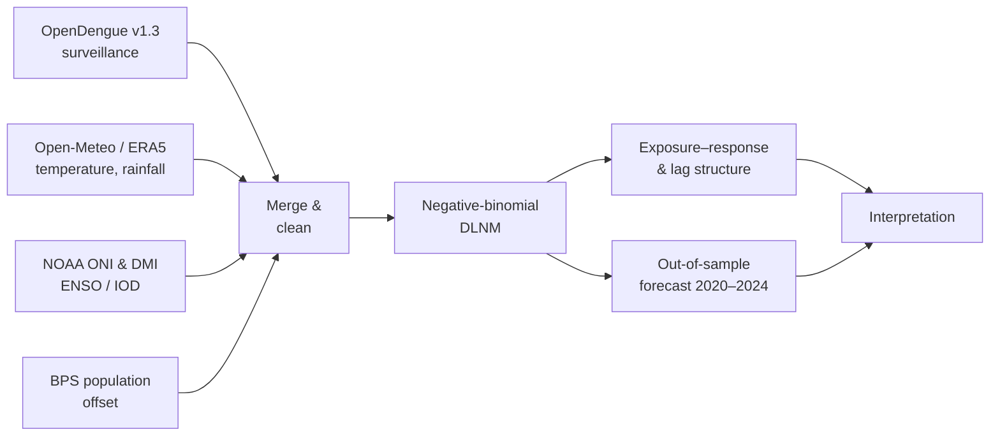
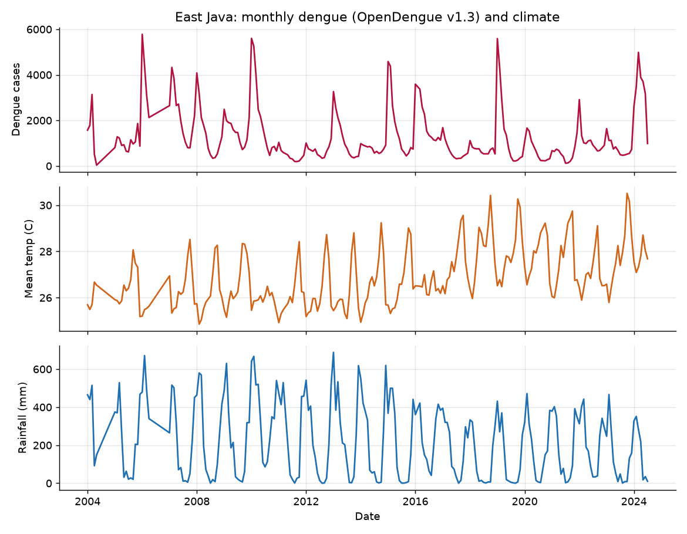
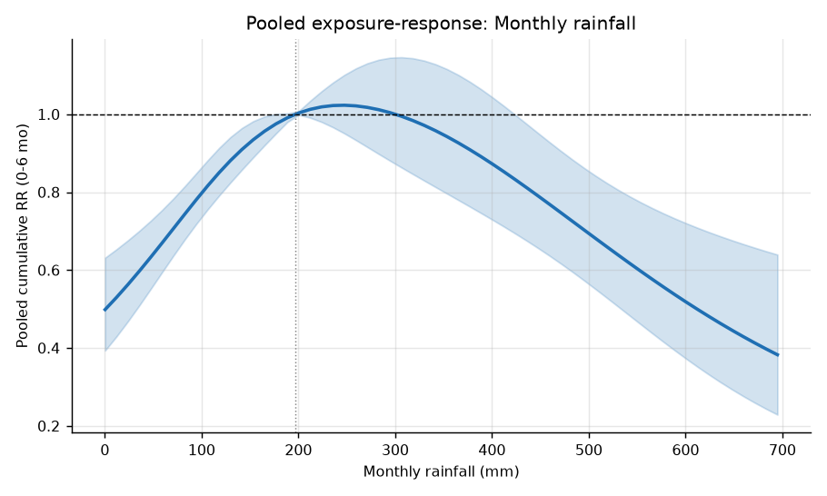
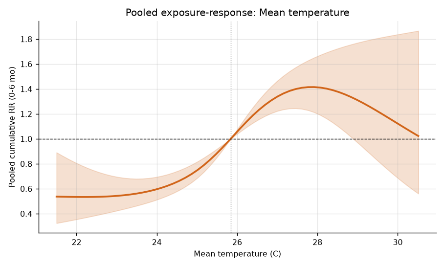
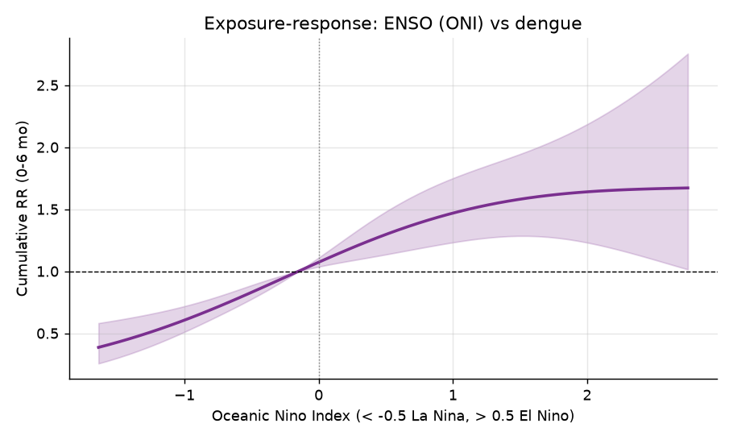
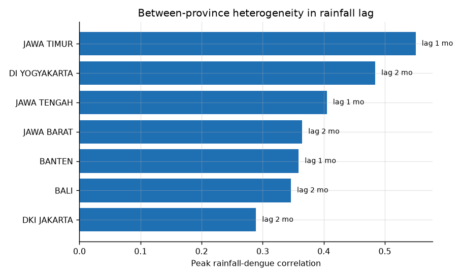
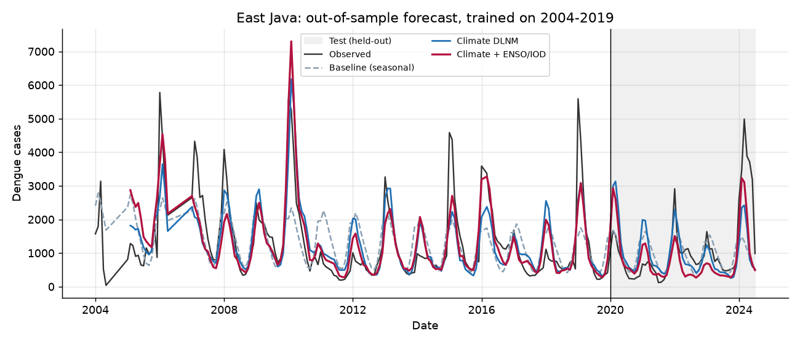

# Climate-driven dengue early warning in Indonesia

*An East Java case study with a seven-province comparison (Java &amp; Bali), 2004–2024.*

A reproducible distributed-lag non-linear modelling (DLNM) analysis of how
temperature, rainfall, and large-scale climate drivers (ENSO, the Indian Ocean
Dipole) relate to dengue incidence across seven Indonesian provinces, 2004–2024,
with an out-of-sample forecast-skill evaluation.

This repository is a compact, end-to-end demonstration of the eco-epidemiological
modelling that underpins climate-based dengue early-warning systems: it links open
surveillance with open climate reanalysis, fits a negative-binomial DLNM of dengue
incidence, quantifies the delayed effect of climate, and tests whether that signal
improves forecasts of held-out epidemics.

> **Author:** Serius Miliyani Dwi Putri — M.Ked.Trop (Epidemiology, Tropical
> Medicine). Research Manager, Climate and Health Centre, Universitas Brawijaya.

---

## Motivation

Dengue is among the fastest-growing vector-borne diseases, and Indonesia carries
one of the highest burdens in Southeast Asia. Temperature and rainfall govern
*Aedes* survival, biting, and the extrinsic incubation period, with effects that
play out over **weeks to months** — precisely the delayed structure a
distributed-lag model is built to quantify, and what makes forecasting with useful
lead time possible. Routine surveillance in Indonesia remains largely reactive;
this project is a minimal, honest step toward anticipation.

## Workflow



## Data

| Component | Source | Resolution | Notes |
|-----------|--------|-----------|-------|
| Dengue cases | [OpenDengue](https://opendengue.org) v1.3 (LSHTM) | Monthly, province (Admin1) | Real. Standardised from official Indonesian / WHO reporting. |
| Climate | [Open-Meteo Historical API](https://open-meteo.com/en/docs/historical-weather-api) (ERA5-based) | Daily → monthly | Free, no API key. |
| ENSO / IOD | NOAA CPC (ONI) + NOAA PSL (DMI) | Monthly | Large-scale drivers. |
| Population | BPS Statistics Indonesia | Annual → monthly | Model offset for incidence. |

Seven provinces with near-complete monthly coverage are analysed: East Java, West
Java, Central Java, DKI Jakarta, Banten, Bali, and DI Yogyakarta.

## Methods

A **negative-binomial DLNM** (Gasparrini 2011; Lowe et al. 2021):

- A *cross-basis* jointly models the non-linear exposure–response **and** the
  0–6 month lagged effect of temperature and rainfall.
- Large-scale drivers **ENSO (ONI)** and **IOD (DMI)** enter as additional
  cross-bases (East Java) and as lagged terms in the forecast model.
- A **population offset** (BPS) converts counts to **incidence**.
- The model adjusts for **seasonality** (cyclic harmonics) and **long-term trend**;
  negative-binomial errors handle overdispersion.
- Two scales: a single-province deep-dive (East Java) and a **pooled seven-province
  model** with province-specific baselines.

Two equivalent implementations are provided: a self-contained Python pipeline
(`scripts/`) and the canonical [`dlnm`](https://cran.r-project.org/package=dlnm)
R package (`analysis/dlnm_model.R`).

## Results

**Seasonality and the raw series.** Dengue in East Java is strongly seasonal;
mean temperature drifts upward across the two decades.



**Rainfall (pooled, 7 provinces).** Risk rises with rainfall up to ~200–250 mm,
then declines at very high rainfall — consistent with heavy rain flushing out
larval habitat.



**Temperature (pooled, 7 provinces).** Risk increases with temperature to a peak
near 28 °C, then plateaus — the expected thermal-optimum shape.



**ENSO (East Java).** Relative to neutral conditions, dengue risk is lower under
La Niña and higher under El Niño (cumulative over a 0–6 month lag).



**Between-province heterogeneity.** The peak rainfall–dengue association clusters
at a **1–2 month lag** in every province — the lead time an early-warning system
can exploit.



**Out-of-sample forecast.** Trained only on 2004–2019, the model forecasts the
held-out 2020–2024 period. For East Java, the climate model — and especially the
addition of ENSO/IOD — tracks held-out epidemics more closely than a seasonal
baseline.



## Key findings

- Dengue incidence in East Java closely tracks seasonal climate variability.
- **Rainfall shows the strongest delayed association**, peaking at ~1 month lag in
  East Java (and 1–2 months across the seven provinces).
- The DLNM captures both the **non-linear** exposure–response and the **lagged**
  effect that simpler models miss.
- **In East Java, adding climate — and especially ENSO/IOD — improved
  out-of-sample forecast skill** over a seasonal baseline (correlation with
  held-out cases 0.38 → 0.53 → 0.70; RMSE 965 → 899 → 783). *Skill was
  heterogeneous across provinces*, which is itself a research question rather than
  a solved problem.
- On outbreak detection in the held-out period, the climate model flagged a
  meaningful share of true outbreak months while the seasonal baseline flagged
  none — though sensitivity (~0.4) leaves clear room for improvement.

## Repository structure

```
scripts/     Python pipeline: 00 synthetic climate · 01 real climate ·
             01b ENSO/IOD indices · 02 merge+population · 03 East Java model ·
             04 pooled 7-province model · 05 forecast-skill evaluation
analysis/    dlnm_model.R — canonical dlnm implementation
data/        raw/ OpenDengue + BPS population · processed/ merged datasets
figures/     Generated figures (fig*.png East Java; mp_*.png multi-province;
             fc_*.png forecast)
writeup/     preprint.pdf + preprint.tex + report.md + metrics summaries
```

## How to run

```bash
pip install -r requirements.txt
cd scripts

# Real data (recommended):
python 01_fetch_climate.py            # temperature & rainfall (Open-Meteo, no key)
python 01b_fetch_climate_indices.py   # ENSO (ONI) + IOD (DMI) from NOAA
python 02_build_dataset.py
python 03_dlnm_model.py               # East Java incidence model
python 04_multiprovince.py            # pooled 7-province model
python 05_forecast_eval.py            # out-of-sample forecast skill
```

To run offline on demonstration climate, replace steps 01/01b with
`python 00_make_synthetic_climate.py` (figures are then tagged accordingly).
Rebuild the PDF preprint with `pdflatex writeup/preprint.tex` (run twice).

## Limitations

- Each province is represented by a single climate point (not an areal average).
- Case definitions vary across the OpenDengue source period; 2020–2021
  surveillance was disrupted by COVID-19, making the forecast test period a hard,
  realistic stress test.
- The forecast uses observed reanalysis climate over the test window, which
  isolates the value of the lagged relationship; genuine operational forecasting
  beyond the lag horizon would require seasonal climate forecasts as input.

## Future work

- Hierarchical Bayesian DLNM (e.g. INLA) with district-level spatial structure.
- Incorporating ENSO/IOD, urbanisation, and human mobility more fully.
- Real-time, operational forecasting driven by seasonal climate forecasts.
- Co-designed, district-level alert thresholds with health authorities.
- Validation against higher-resolution Ministry of Health surveillance.

## Citation

Dengue — Clarke J, et al. *A global dataset of publicly available dengue case
count data.* Sci Data. 2024;11:296 (OpenDengue v1.3).
Method — Gasparrini A. *Distributed lag linear and non-linear models in R: the
package dlnm.* J Stat Softw. 2011;43(8). · Lowe R, et al. *Combined effects of
hydrometeorological hazards and urbanisation on dengue risk in Brazil.* Lancet
Planet Health. 2021.

## Licence

This repository combines material under two licences:

- **Code** (`scripts/`, `analysis/`, `run_all.sh`) — MIT, see `LICENSE`.
- **Data** (`data/`) — redistributed under the terms set by each original provider,
  not relicensed here. The dengue data comes from [OpenDengue](https://opendengue.org)
  (LSHTM); both licences it states permit redistribution with attribution.

Weather data by [Open-Meteo.com](https://open-meteo.com/), licensed under
[CC BY 4.0](https://creativecommons.org/licenses/by/4.0/). Contains modified
Copernicus Climate Change Service information 2026; neither the European Commission
nor ECMWF is responsible for any use that may be made of it. ENSO and IOD indices
courtesy of NOAA.

See [`DATA_LICENSE.md`](DATA_LICENSE.md) for full attribution requirements and
per-file provenance.
